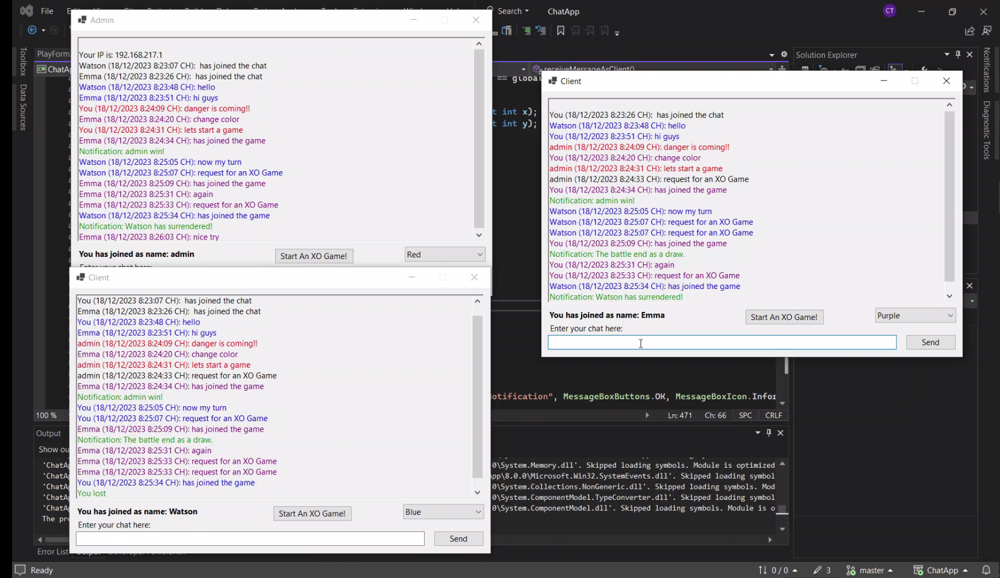
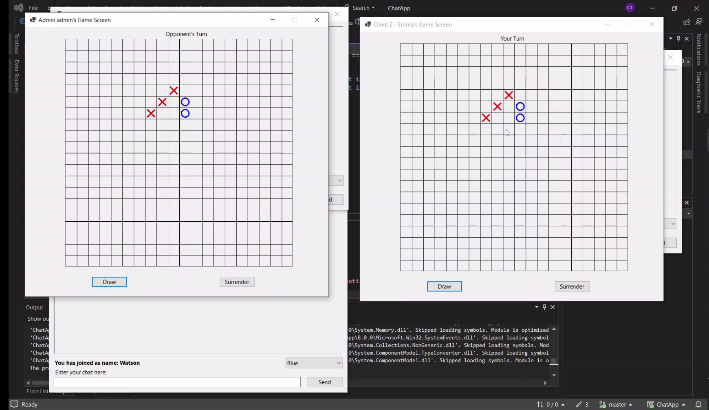
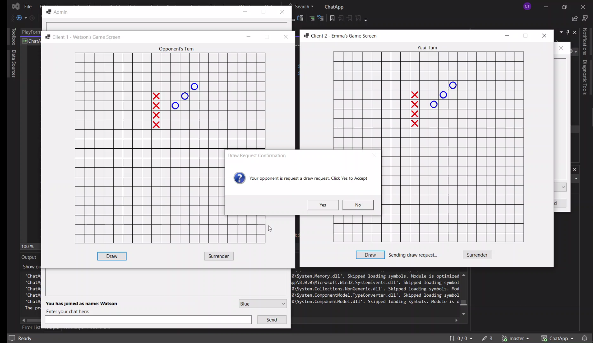
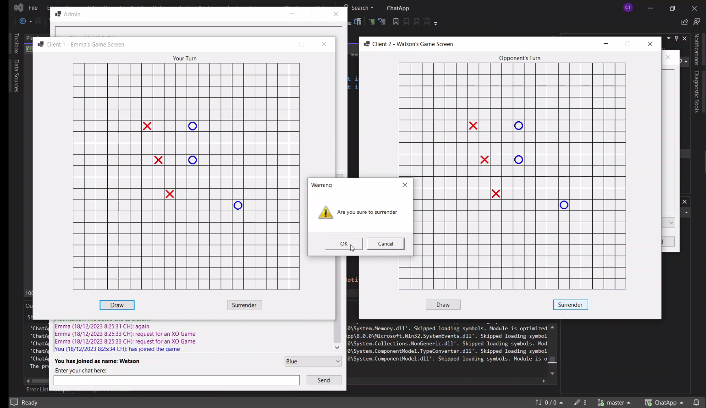

# ChatApp
A simple chat app using C# Winforms that allow users to chat with friends via LAN, or play an XO-GAME (20x20)
# Demo
See demo here: https://youtu.be/tEeZBQea0bA
# Ultilities:
- Create a chat for user, the user click "Create A Chat" will be a server.
- After create a chat, your IP will appear in the chat, enter the IP shown on the screen to enter the chat.
- Change the color to chat easier.
- Create an XO Game between server - client, client - server, client - client.
- Draw request or surrender.
# Previews
## Chat Screen

## Game Screen

## Draw

## Surrender

